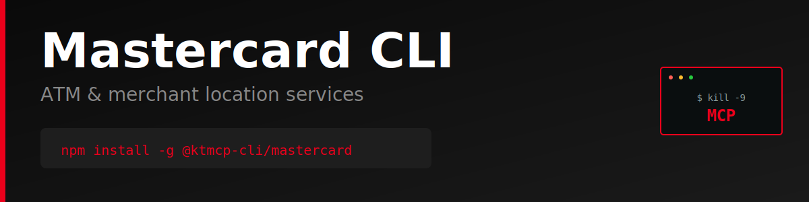

> "Six months ago, everyone was talking about MCPs. And I was like, screw MCPs. Every MCP would be better as a CLI."
>
> — [Peter Steinberger](https://twitter.com/steipete), Founder of OpenClaw
> [Watch on YouTube (~2:39:00)](https://www.youtube.com/@lexfridman) | [Lex Fridman Podcast #491](https://lexfridman.com/peter-steinberger/)

# Mastercard CLI

Production-ready command-line interface for the [Mastercard Locations API](https://developer.mastercard.com/product/locations/) - ATM and merchant location services.

> **⚠️ Unofficial CLI** - This tool is not officially sponsored, endorsed, or maintained by Mastercard. It is an independent project built on the public Mastercard Locations API. API documentation: https://developer.mastercard.com/product/locations/

## Features

- Search for ATMs near any location
- Find nearest ATMs with distance sorting
- Search for merchants by category and location
- Filter merchants by type (restaurant, retail, gas, etc.)
- JSON and pretty-print output formats
- Persistent configuration storage
- Progress indicators for long-running operations

## Why CLI > MCP

### The MCP Problem

Model Context Protocol (MCP) servers introduce unnecessary complexity and failure points for API access:

1. **Extra Infrastructure Layer**: MCP requires running a separate server process that sits between your AI agent and the API
2. **Cognitive Overhead**: Agents must learn MCP-specific tool schemas on top of the actual API semantics
3. **Debugging Nightmare**: When things fail, you're debugging three layers (AI → MCP → API) instead of two (AI → API)
4. **Limited Flexibility**: MCP servers often implement a subset of API features, forcing you to extend or work around limitations
5. **Maintenance Burden**: Every API change requires updating both the MCP server and documentation

### The CLI Advantage

A well-designed CLI is the superior abstraction for AI agents:

1. **Zero Runtime Dependencies**: No server process to start, monitor, or crash
2. **Direct API Access**: One hop from agent to API with transparent HTTP calls
3. **Human + AI Usable**: Same tool works perfectly for both developers and agents
4. **Self-Documenting**: Built-in `--help` text provides complete usage information
5. **Composable**: Standard I/O allows piping, scripting, and integration with other tools
6. **Better Errors**: Direct error messages from the API without translation layers
7. **Instant Debugging**: `--json` gives you the exact API response for inspection

**Example Complexity Comparison:**

MCP approach:
```
AI Agent → MCP Tool Schema → MCP Server → HTTP Request → API → Response Chain (reverse)
```

CLI approach:
```
AI Agent → Shell Command → HTTP Request → API → Direct Response
```

The CLI is simpler, faster, more reliable, and easier to debug.

## Installation

```bash
npm install -g @ktmcp-cli/mastercard
```

## Configuration

### Set API Key

Get your API key from https://developer.mastercard.com/

```bash
mastercard config set apiKey YOUR_API_KEY_HERE
```

### Environment Variables

Alternatively, use environment variables:

```bash
export MASTERCARD_API_KEY=your_api_key_here
export MASTERCARD_BASE_URL=https://api.mastercard.com/locations/v1  # Optional
```

### View Configuration

```bash
# Show all config
mastercard config list

# Get specific value
mastercard config get apiKey

# Clear config
mastercard config clear
```

## Usage

### ATM Search

```bash
# Search for ATMs within 5km radius
mastercard atms search --lat 37.7749 --lng -122.4194 --radius 5

# Search with custom limit
mastercard atms search --lat 40.7128 --lng -74.0060 --radius 10 --limit 50

# Find nearest ATMs
mastercard atms nearby --lat 51.5074 --lng -0.1278 --count 10

# Get as JSON
mastercard atms search --lat 37.7749 --lng -122.4194 --json
```

### Merchant Search

```bash
# Search for merchants within 5km
mastercard merchants search --lat 37.7749 --lng -122.4194 --radius 5

# Search by category
mastercard merchants search --lat 40.7128 --lng -74.0060 --category restaurant
mastercard merchants search --lat 51.5074 --lng -0.1278 --category retail

# Find nearest merchants
mastercard merchants nearby --lat 37.7749 --lng -122.4194 --count 5

# Find nearest merchants by category
mastercard merchants nearby --lat 40.7128 --lng -74.0060 --category gas --count 3

# Get as JSON
mastercard merchants search --lat 37.7749 --lng -122.4194 --json
```

### Common Merchant Categories

- `restaurant` - Restaurants and dining
- `retail` - Retail stores
- `gas` - Gas stations
- `grocery` - Grocery stores
- `hotel` - Hotels and lodging
- `entertainment` - Entertainment venues

## Output Formats

All commands support `--json` flag for machine-readable output:

```bash
mastercard atms search --lat 37.7749 --lng -122.4194 --json | jq '.[0]'
```

## Error Handling

The CLI provides clear error messages with suggestions:

```bash
$ mastercard atms search
✗ API key not configured. Set it with: mastercard config set apiKey <your-api-key>
```

## Development

```bash
# Clone and install
git clone https://github.com/ktmcp-cli/mastercard.git
cd mastercard
npm install

# Link locally
npm link

# Run
mastercard --help
```

## License

MIT

## Links

- [Mastercard Developer Portal](https://developer.mastercard.com/)
- [Mastercard Locations API Documentation](https://developer.mastercard.com/product/locations/)
- [GitHub Repository](https://github.com/ktmcp-cli/mastercard)
- [npm Package](https://www.npmjs.com/package/@ktmcp-cli/mastercard)
